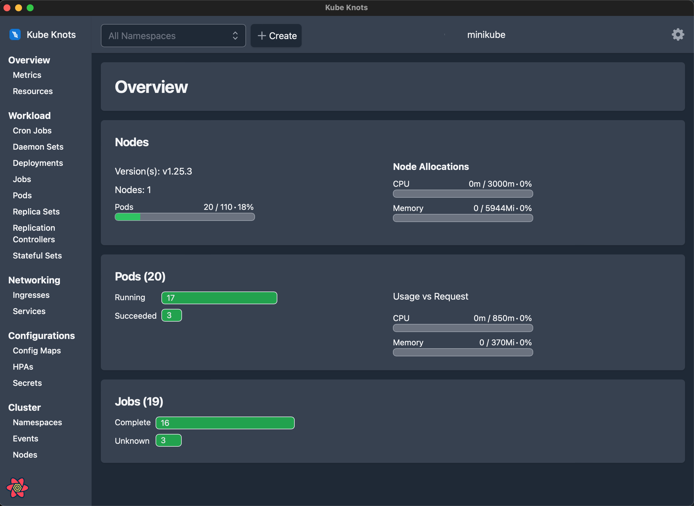

# Kube Knots

Helping untangle the kubernetes web. Kube Knot is a desktop application built using rust to help you manage your kubernetes cluster.



## What's in this repo?

This repo is structured as a monorepo with two applications.

```
├── app
│   ├── docs
│   │   ├── blog      - blog posts, I may use this for release notes
│   │   ├── docs      - documentation for the project in markdown
│   │   ├── src       - the source code for the main pages outside of documentations
│   └── kube-knots
│       ├── src       - the source code for the UI
│       ├── src-tauri - the source code for the backend
```

## Development

See [development docs](https://www.davidhu.io/kube-knots/docs/contributing/local-development)

## Contributing

See [contributing docs](https://www.davidhu.io/kube-knots/docs/contributing/contributing)
