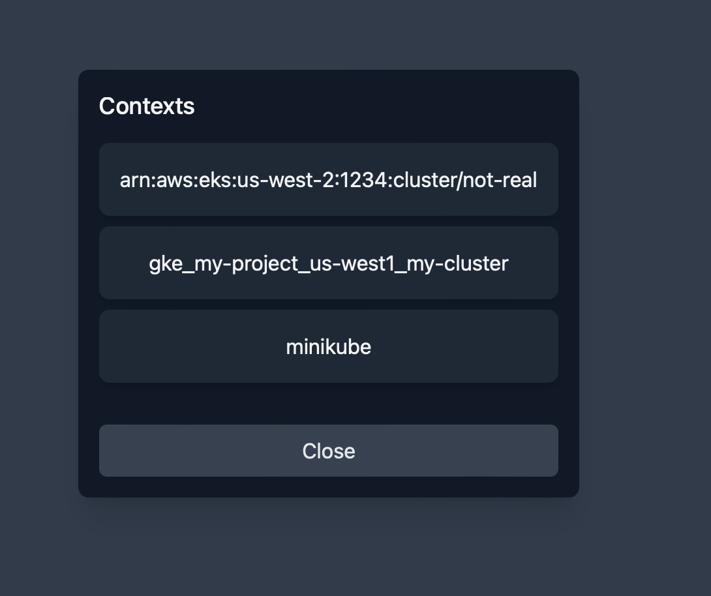

# Auto detect clusters

Auto detect clusters from `~/.kube/config` file.

Quickly switch between clusters using the cluster selector.

Note that this functionality does not update the `current-context` value in your `~/.kube/config` file.
