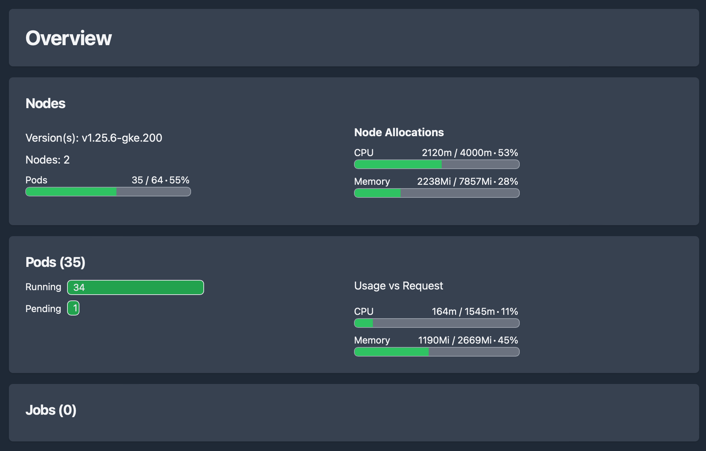
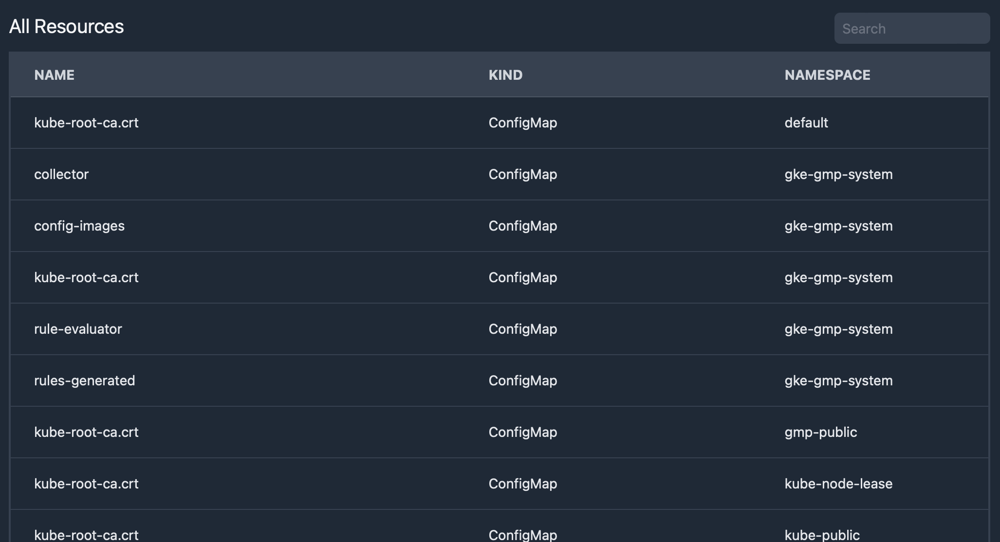
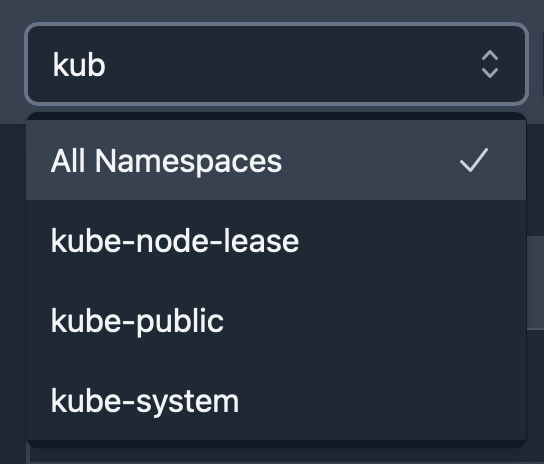

# Cluster overview

See overview of high level metrics on your cluster, such as number of pods, node cpu/memory usage, and more.

See the full list of resources in your cluster, or just workloads, services, or configs.

## Namespace Typeahead

Quickly filter resources by namespace using the namespace selector.

It supports type filtering so you can quickly find the namespace you want.
