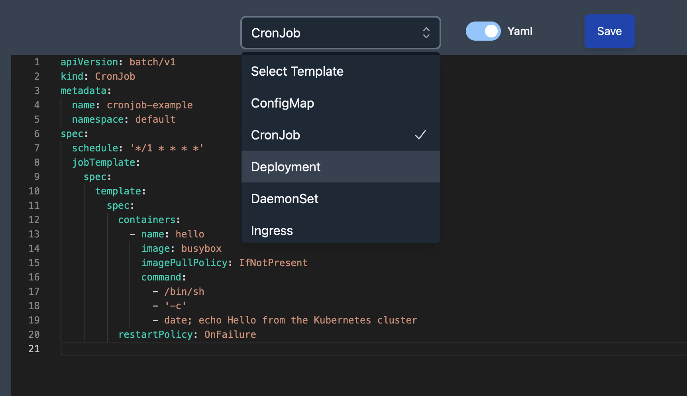

# Resource Creation Templates

Resource creation form supplies a list of example templates for the selected resource type. You can use these templates to create a new resource.

As always, YAML and JSON are supported.
