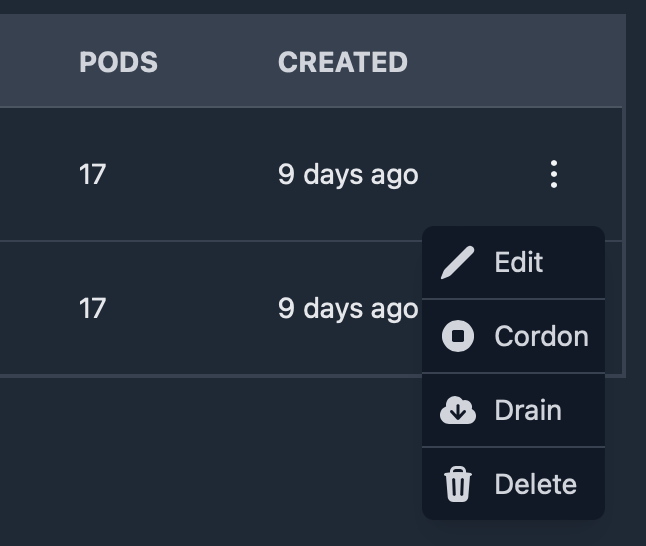

# Actions on resources & nodes

## Resource Actions

The follow are a list of support actions on resources.

- create
- delete
- edit
- logs
- restart
- scale
- trigger

These actions are built into Kube Knots and can be activated by clicking the action button on the resource table.

Note that some actions are only available on certain resource types. For example, the `scale` action is only available on `Deployment` and `StatefulSet` resources.

Most destructive actions will prompt the user for confirmation before executing. The follow example is a delete confirmation modal.

## Node Actions

The follow are a list of support actions on nodes.

- edit
- drain
- cordon
- uncordon
- delete

These actions are built into Kube Knots and can be activated by clicking the action button on the node table.

Cordon/uncordon action dynamically changes based on the node's current state.

