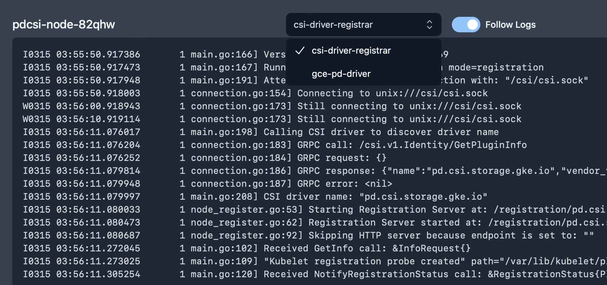

# View pod logs

View live logs from your pod, with the ability to view logs by container.

Also supports functionality to follow logs. This will automatically scroll to the bottom of the logs as new logs are added.
