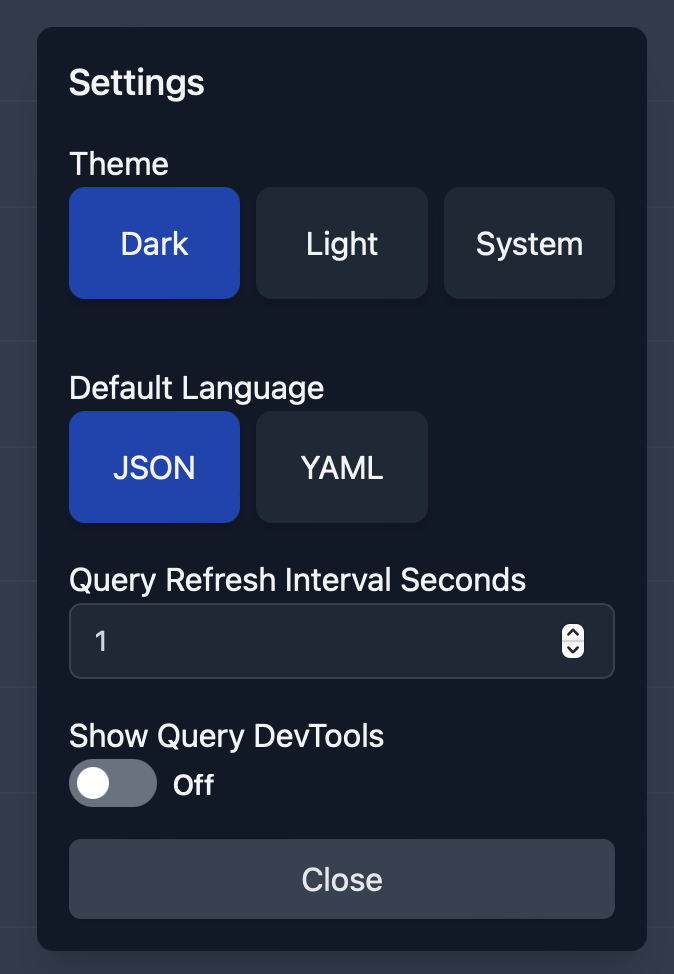

# Configurations



## Available Settings

The most important thing of any software: Light/Dark mode support. You can pick between Dark, Light, or System (which will follow your OS's theme).

You can also

- pick your favorite language between YAML and JSON
- configure the query interval to refetch data. The default is every 2 seconds.
- Toggle on react query dev tools to help debug issues.

## Applcation Logging

All logs are written a standard log file in the following location:

MacOs:

```
/Users/<your user>/Library/Logs/com.kubeknots.dev/Kube Knots.log
```

Windows:

```
C:\Users\<your user>\AppData\Roaming\Kube Knots\logs\Kube Knots.log
```

Linux:

```
~/.config/Kube Knots/logs/Kube Knots.log
```
