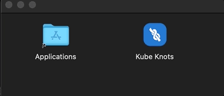
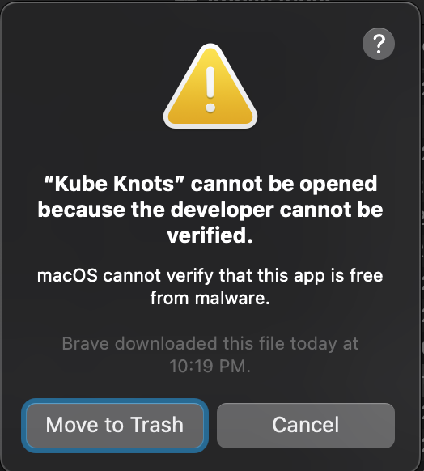
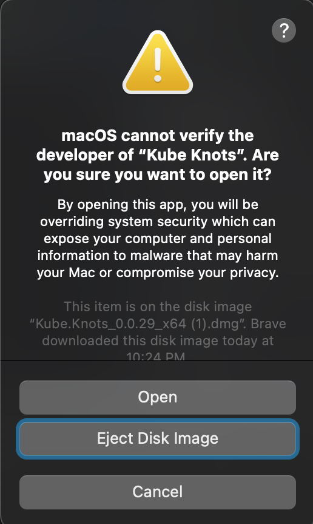

# macOS

Download the `.dmg` file from the [Downloads](/downloads) page. And double click the downloaded file to open the Disk Image.

Drag `Kube Knots` into the `Applications` folder.



You will see an error when opening the app for the first time:



This is because the app is not signed by Apple. (For now at least)

To get around this, right click on the app and click "Open". You will see a dialog box that says "Kube Knots" cannot be opened because the developer cannot be verified.



Click "Open" and the app will open.

## Apple Silicon Build Error

If you are using an Apple Silicon Mac, you will see an error when you try to open the app:

> Kube Knots is damaged and can't be opened. You should move it to the Trash.

This is because the app is not signed by Apple. (Again, for now at least). See the [tauri issue](https://github.com/tauri-apps/tauri/issues/5778) for more details.

To get around this, we can use the `xattr` command to remove the quarantine attribute from the app.

```bash
xattr -rc /Applications/Kube\ Knots.app
```

Then you can open the app.
