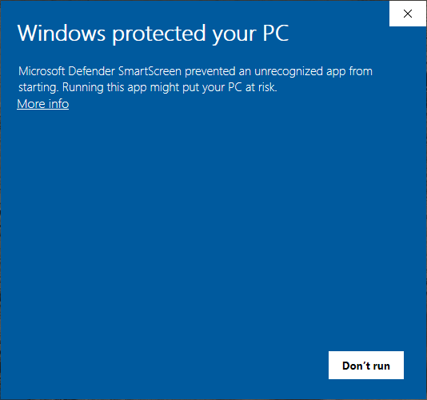
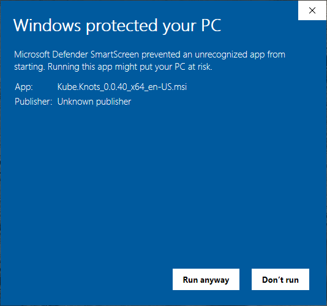
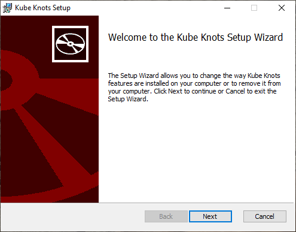
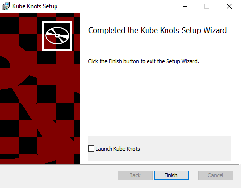

# Windows

After downloading the latest version of the windows `.msi` file. Double click the file to start the installation process.

You'll see this warning

This is because the app is not signed. (For now at least)

Click `More Info` and then click `Run anyway`

Then windows will show the typical installation dialog.

Click `Next` to continue.

During the installation process, you'll get a warning

> Do you want the allow the following program from an unknown publisher to make changes to this computer?

Click `Yes` to continue.

When you see this dialog, click `Finish`. And you're done!

