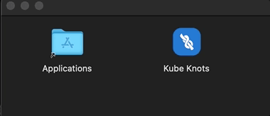
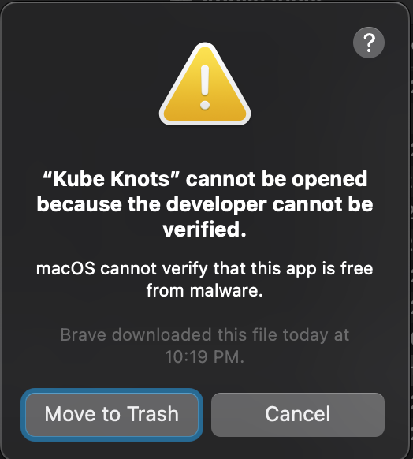
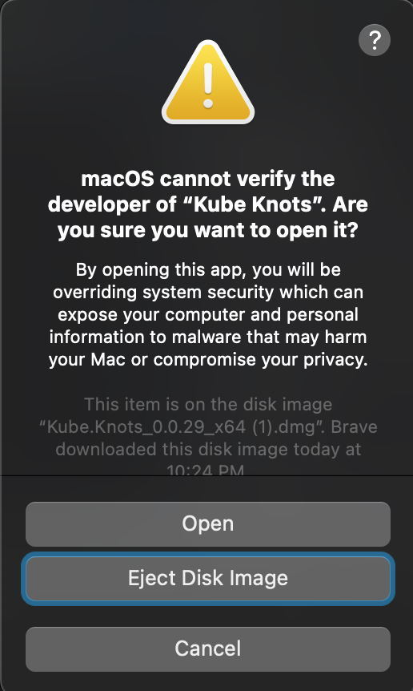

# Installing the App

## macOS

Download the `.dmg` file from the [Downloads](/downloads) page. And double click the downloaded file to open the Disk Image.

Drag `Kube Knots` into the `Applications` folder.

You will see an error when opening the app for the first time:

This is because the app is not signed by Apple. (For now at least)

To get around this, right click on the app and click "Open". You will see a dialog box that says "Kube Knots" cannot be opened because the developer cannot be verified.

Click "Open" and the app will open.

## Linux

TODO

## Windows

TODO
