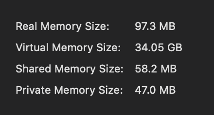
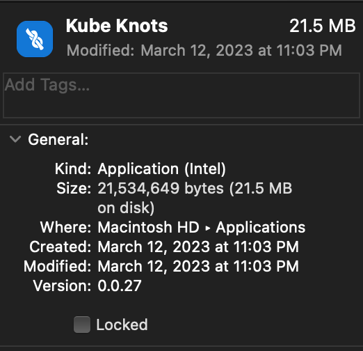

# Introduction

Kube Knots was built using [Tauri](https://tauri.app/) and [ReactJS](https://reactjs.org/). It is a desktop application that allows you to manage your Kubernetes clusters with ease.

See the [Features](/docs/category/features) page for more information on what Kube Knots can do to help you manage your clusters.

## Why Kube Knots?

### Open Source

Kube Knots is open source and free to use. You can find the source code on [GitHub](https://github.com/davidhu2000/kube-knots)

### Low Resource Usage

Kube Knots is not built using Electron as many other desktop applications are. This means that it uses less resources, especially memory.

### Application Size

Kube Knots is only <30MB in size on macOS.

